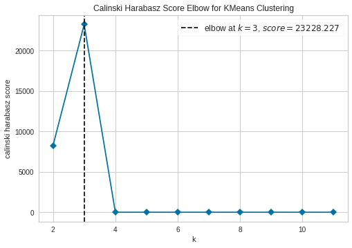
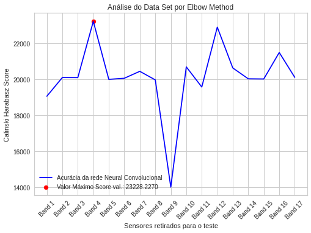

# Relatório Desafio 3

O "Elbow Method" é uma técnica utilizada para auxiliar cientistas de dados a determinar
o número ideal de clusters, ajustando o modelo com um intervalo de valores K, e com o gráfico possuindo o traçado que se assemelha a um braço, será no cotovelo ou ponto
de inflexão da curva um indicativo de que o modelo tem melhor representação naquele ponto.
Este trabalho é implementado por meio do método de clusterização "KMeans" da biblioteca sklearn
que é utilizado para gerar o modelo e também com o método "KElbowVisualizer" fornecido pela biblioteca
Yellowbrick que auxilia na plotagem de dados e cálculo das métricas do "Elbow Method", por padrão a
biblioteca utiliza como métrica a "distortion", que representa a soma das distâncias quadradas de cada
ponto ao centro atribuído, entretanto no contexto do projeto foi adotada a métrica "calinski_harabasz",
que determina o score calculando a razão de dispersão entre e dentro dos clusters.
A partir do dataset dado, temos como parâmetros 17 sensores e 4 "máquinas", e devemos determinar qual sensor
opera em defeito. Assumindo como hipotése que o sensor com defeito impacta negativamente no score da clusterização
dos dados, podemos implementar uma iteração de clusterizações, onde em cada iteração excluímos a presença de um sensor
a iteração em que obtivermos o melhor score, será onde o sensor que apresenta falha foi retirado, logo pelo gráfico de
"Análise do Data Set por Elbow Method" temos que o sensor 4 é o que impacta o modelo com o melhor score quando retirado,
sendo portanto o sensor 4 o defeituoso, outro aspecto interessante é que o modelo aponta para a existência de 3 clusters,
logo aparentemente, entre as 4 máquinas temos duas máquinas iguais.

## Screenshots

